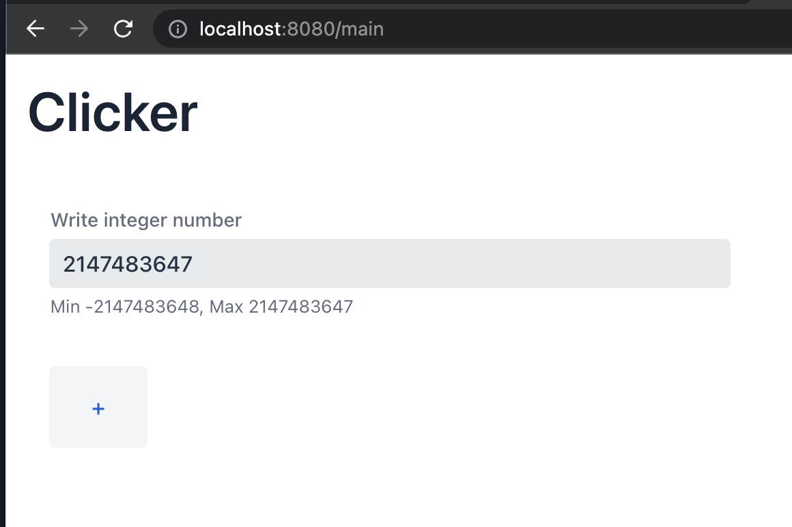

# Clicker



## Описание

Данное приложение "Clicker" реализовано с использованием Java, Spring Boot, Vaadin и базы данных H2. Приложение позволяет пользователям увеличивать счетчик, нажимая на кнопку, и сохранять значение счетчика в базе данных.

Основные функции приложения Clicker включают:
- Увеличение значения счетчика при нажатии на кнопку "+".
- Отображение текущего значения счетчика на пользовательском интерфейсе.
- Сохранение значения счетчика в базе данных H2.
- Получение и обновление значения счетчика из базы данных.

Приложение создано с использованием фреймворка Spring Boot, который обеспечивает прочную основу для разработки веб-приложений на Java. Vaadin используется для создания интерактивных веб-страниц с помощью Java. База данных H2 используется в качестве легковесной встроенной базы данных для хранения значений счетчика.

## Предварительные требования
- Java 17
- Maven

## Установка
1. Клонируйте репозиторий: `git clone https://github.com/your-username/clicker-app.git`
2. Перейдите в директорию проекта: `cd clicker-app`
3. Соберите приложение: `mvn clean package`
4. Запустите приложение: `mvn spring-boot:run`
5. Откройте приложение в веб-браузере по адресу `http://localhost:8080`

## Использование
1. Откройте приложение Clicker в веб-браузере.
2. Нажмите кнопку "+" для увеличения значения счетчика.
3. Обновленное значение счетчика будет отображено на пользовательском интерфейсе.
4. Значение счетчика автоматически сохраняется в базе данных после каждого увеличения.

## Структура проекта
Структура проекта соответствует стандартной структуре Maven проекта. Основные файлы и директории включают:
- `src/main/java`: Содержит исходный код на Java.
- `src/main/resources`: Содержит файлы свойств приложения и статические ресурсы.
- `src/test`: Содержит тестовые случаи для приложения.
- `pom.xml`: Содержит зависимости проекта и его конфигурацию.


## Prerequisites

- Java 17
- Maven

## Installation

1. Clone the repository:

   ```
   git clone https://github.com/your-username/clicker-app.git
   ```

2. Navigate to the project directory:

   ```
   cd clicker-app
   ```

3. Build the application:

   ```
   mvn clean package
   ```

4. Run the application:

   ```
   mvn spring-boot:run
   ```

5. Доступ к приложению в веб-браузере по адресу `http://localhost:8080`

6. Доступ к базе данных в веб-браузере по адресу `http://localhost:8080/h2-console`

## Usage

1. Откройте приложение Clicker в веб-браузере.
2. Нажмите кнопку "+", чтобы увеличить значение счетчика.
3. Обновленное значение счетчика будет отображено в пользовательском интерфейсе.
4. После каждого увеличения значение счетчика автоматически сохраняется в базе данных.

## Project Structure

```
clicker-app/
├── src/
│   ├── main/
│   │   ├── java/
│   │   │   └── com/
│   │   │       └── example/
│   │   │           └── clicker/
│   │   │               ├── controller/
│   │   │               ├── model/
│   │   │               ├── repository/
│   │   │               ├── MainApplication.java
│   │   │               └── ...
│   │   └── resources/
│   │       ├── application.properties
│   │       └── ...
│   └── test/
│       └── ...
├── pom.xml
└── ...
```

## Используемые технологии
- Java
- Spring Boot
- Vaadin
- База данных H2
- Maven

